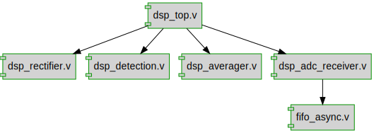

# Documentation for: iota_interview

Generated by **TerosHDL** © 2020-2021 License GPLv3 Carlos Alberto Ruiz Naranjo (carlosruiznaranjo@gmail.com) Ismael Perez Rojo (ismaelprojo@gmail.com)  Project revision 2022-09-27 19:37:38  

## Designs

- Module: [fifo_async ](./doc_internal/fifo_async.md)
- Module: [dsp_rectifier ](./doc_internal/dsp_rectifier.md)
- Module: [dsp_detection ](./doc_internal/dsp_detection.md)
- Module: [dsp_averager ](./doc_internal/dsp_averager.md)
- Module: [dsp_adc_receiver ](./doc_internal/dsp_adc_receiver.md)
- Module: [dsp_top ](./doc_internal/dsp_top.md)

