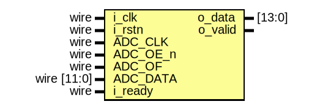

# Entity: dsp_adc_receiver 

- **File**: dsp_adc_receiver.v
## Diagram

## Ports

| Port name | Direction | Type        | Description                              |
| --------- | --------- | ----------- | ---------------------------------------- |
| i_clk     | input     | wire        | 100MHz system clock                      |
| i_rstn    | input     | wire        | Synchronous active-low reset             |
| ADC_CLK   | input     | wire        | ADC clock                                |
| ADC_OE_n  | input     | wire        | ADC active-low valid                     |
| ADC_OF    | input     | wire        | ADC overflow                             |
| ADC_DATA  | input     | wire [11:0] | ADC data; 12-bit 2's complement          |
| i_ready   | input     | wire        | Indicates slave is ready to receive data |
| o_data    | output    | [13:0]      | Output data                              |
| o_valid   | output    |             | Indicates o_data is valid                |
## Signals

| Name        | Type        | Description                               |
| ----------- | ----------- | ----------------------------------------- |
| q_adc_oe_n  | reg         | FF used for ADC_oe_n SoF detection        |
| adc_sof     | wire        | Indicates ADC_oe_n falling edge; SoF flag |
| fifo_wr     | wire        | Internal async FIFO write enable          |
| fifo_rd     | wire        | Internal async FIFO read enable           |
| fifo_rempty | wire        | Internal async FIFO empty flag            |
| fifo_rdata  | wire [13:0] |                                           |
## Processes
- SoF_Detect: ( @(posedge ADC_CLK) )
  - **Type:** always
- Output_Interface: ( @(posedge i_clk) )
  - **Type:** always
## Instantiations

- receiver_buffer_i: fifo_async
