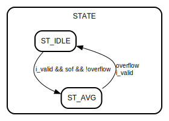

# Entity: dsp_averager 

- **File**: dsp_averager.v
## Diagram

## Ports

| Port name | Direction | Type        | Description                                 |
| --------- | --------- | ----------- | ------------------------------------------- |
| i_clk     | input     | wire        | 100MHz system clock                         |
| i_rstn    | input     | wire        | Sync active-low reset                       |
| i_data    | input     | wire [13:0] | ADC packet data word; see header for format |
| i_valid   | input     | wire        | Indicates i_data is valid                   |
| o_data    | output    | [11:0]      | 12-bit averaged data                        |
| o_valid   | output    |             | Indicates o_data is valid                   |
## Signals

| Name     | Type        | Description                        |
| -------- | ----------- | ---------------------------------- |
| STATE    | reg         | State Flop                         |
| overflow | wire        | ADC packet data word overflow flag |
| sof      | wire        | ADC packet data word SoF flag      |
| avg      | wire [12:0] | o_data combinatorial logic         |
## Constants

| Name    | Type | Value | Description |
| ------- | ---- | ----- | ----------- |
| ST_IDLE |      | 0     |             |
| ST_AVG  |      | 1     |             |
## Processes
- FSM: ( @(posedge i_clk) )
  - **Type:** always
## State machines

