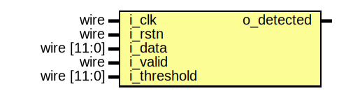

# Entity: dsp_detection 

- **File**: dsp_detection.v
## Diagram

## Ports

| Port name   | Direction | Type        | Description                                |
| ----------- | --------- | ----------- | ------------------------------------------ |
| i_clk       | input     | wire        | 100MHz system clock                        |
| i_rstn      | input     | wire        | Sync active-low reset                      |
| i_data      | input     | wire [11:0] | 12-bit averaged ADC value                  |
| i_valid     | input     | wire        | Indicates i_data is valid                  |
| i_threshold | input     | wire [11:0] | 12-bit threshold value                     |
| o_detected  | output    |             | Indicates i_data is greater than threshold |
## Processes
- threshold: ( @(posedge i_clk) )
  - **Type:** always
